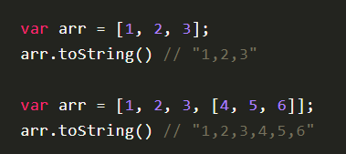
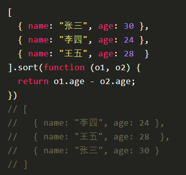
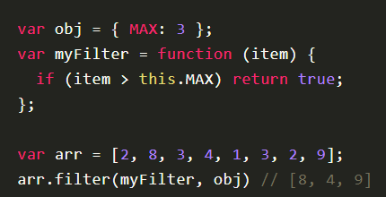
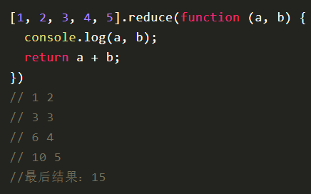

[TOC]

# 字符串对象

#### 字符串的不可变

指的是里面的值不可变，虽然看上去可以改变内容，但其实是地址变了，内存中新开辟了一个内存空间。

字符串一旦创建内容后是不可改变的。若之后再执行赋值操作，则会在栈中开辟新空间，原变量指向新的内存，原来指向的数据还在那个位置。

引用字符串的变量地址变了(指向了新的字符串)，字符串本身没有变。【此时，字符串是对象，str指向的是字符串的地址】

为字符串重复赋值、字符串的拼接等都会引用新的地址空间来存放字符串的值，消耗内存的操作。

#### 字符串方法：

|                            方法名                            | 说明                                                         |
| :----------------------------------------------------------: | :----------------------------------------------------------- |
| [String.prototype.charAt()](https://wangdoc.com/javascript/stdlib/string.html#stringprototypecharat) | 1、`charAt`方法返回指定位置的字符，参数是从`0`开始编号的位置。<br />2、这个方法完全可以用数组下标替代。<br />3、如果参数为负数，或大于等于字符串的长度，`charAt`返回空字符串。<br /> |
| [String.prototype.charCodeAt()](https://wangdoc.com/javascript/stdlib/string.html#stringprototypecharcodeat) |                                                              |
| [String.prototype.concat()](https://wangdoc.com/javascript/stdlib/string.html#stringprototypeconcat) | 1、`concat`方法用于连接两个字符串，返回一个新字符串，不改变原字符串。<br />2、该方法可以接受多个参数。<br />3、如果参数不是字符串，`concat`方法会将其先转为字符串，然后再连接。<br /> |
| **重点**<br /><u>*切片*</u><br />  [String.prototype.slice(start,end)](https://wangdoc.com/javascript/stdlib/string.html#stringprototypeslice) | 1、`slice()`方法用于从原字符串取出子字符串并返回，不改变原字符串。它的第一个参数是子字符串的开始位置，第二个参数是子字符串的结束位置（不含该位置，即前闭后开）。<br />2、如果省略第二个参数，则表示子字符串一直到原字符串结束。<br />3、如果参数是负值，表示从结尾开始倒数计算的位置，即该负值加上字符串长度。<br />4、如果第一个参数大于第二个参数（正数情况下），`slice()`方法返回一个空字符串。<br /> |
| [String.prototype.substring(start,end)](https://wangdoc.com/javascript/stdlib/string.html#stringprototypesubstring) | 1、`substring`方法用于从原字符串取出子字符串并返回，不改变原字符串，跟`slice`方法很相像。它的第一个参数表示子字符串的开始位置，第二个位置表示结束位置（返回结果不含该位置）。<br />2、如果省略第二个参数，则表示子字符串一直到原字符串的结束。<br />3、如果第一个参数大于第二个参数，`substring`方法会自动更换两个参数的位置。<br />4、如果参数是负数，`substring`方法会自动将负数转为0。<br />5、由于这些规则违反直觉，因此不建议使用`substring`方法，应该优先使用`slice`。<br /> |
| [String.prototype.substr(start,length)](https://wangdoc.com/javascript/stdlib/string.html#stringprototypesubstr) | 1、`substr`方法用于从原字符串取出子字符串并返回，不改变原字符串，跟`slice`和`substring`方法的作用相同。<br />2、如果省略第二个参数，则表示子字符串一直到原字符串的结束。<br />3、如果第一个参数是负数，表示倒数计算的字符位置。如果第二个参数是负数，将被自动转为`0`，表示子字符串长度为`0`，因此会返回空字符串。<br /> |
| [String.prototype.indexOf()，String.prototype.lastIndexOf()](https://wangdoc.com/javascript/stdlib/string.html#stringprototypeindexofstringprototypelastindexof) | 1、`indexOf`方法用于确定一个字符串在另一个字符串中第一次出现的位置，返回结果是匹配开始的位置。如果返回`-1`，就表示不匹配。<br />2、`indexOf`方法还可以接受第二个参数，表示从该位置开始向后匹配。<br />3、`lastIndexOf`方法的用法跟`indexOf`方法一致，主要的区别是`lastIndexOf`从尾部开始匹配，`indexOf`则是从头部开始匹配。<br />4、另外，`lastIndexOf`的第二个参数表示从该位置起向前匹配。<br /> |
| [String.prototype.trim()](https://wangdoc.com/javascript/stdlib/string.html#stringprototypetrim) | 1、`trim`方法用于去除字符串两端的空格，返回一个新字符串，不改变原字符串。<br />2、该方法去除的不仅是空格，还包括制表符（`\t`、`\v`）、换行符（`\n`）和回车符（`\r`）。<br /> |
| [String.prototype.toLowerCase()，String.prototype.toUpperCase()](https://wangdoc.com/javascript/stdlib/string.html#stringprototypetolowercasestringprototypetouppercase) | 1、`toLowerCase`方法用于将一个字符串全部转为小写，`toUpperCase`则是全部转为大写。<br />2、它们都返回一个新字符串，不改变原字符串。<br /> |
| [String.prototype.match()](https://wangdoc.com/javascript/stdlib/string.html#stringprototypematch) | 1、`match`方法用于确定原字符串是否匹配某个子字符串，返回一个数组，成员为匹配的第一个字符串。如果没有找到匹配，则返回`null`。<br />2、返回的数组还有`index`属性和`input`属性，分别表示匹配字符串开始的位置和原始字符串。<br />3、`match`方法还可以使用正则表达式作为参数。<br /> |
| [String.prototype.search()](https://wangdoc.com/javascript/stdlib/string.html#stringprototypesearchstringprototypereplace) | 1、`search`方法的用法基本等同于`match`，但是返回值为匹配的第一个位置。如果没有找到匹配，则返回`-1`。<br />2、`search`方法还可以使用正则表达式作为参数。<br /> |
| [String.prototype.replace()](https://wangdoc.com/javascript/stdlib/string.html#stringprototypesearchstringprototypereplace) | 1、`replace`方法用于替换匹配的子字符串，一般情况下只替换第一个匹配（除非使用带有`g`修饰符的正则表达式）。<br />2、`replace`方法还可以使用正则表达式作为参数。<br /> |
| **重点** <br /> [String.prototype.split()](https://wangdoc.com/javascript/stdlib/string.html#stringprototypesplit) | 1、`split`方法按照给定规则分割字符串，返回一个由分割出来的子字符串组成的数组。<br />2、如果分割规则为空字符串，则返回数组的成员是原字符串的每一个字符。<br />3、如果省略参数，则返回数组的唯一成员就是原字符串。<br />4、如果满足分割规则的两个部分紧邻着（即两个分割符中间没有其他字符），则返回数组之中会有一个空字符串。<br />5、如果满足分割规则的部分处于字符串的开头或结尾（即它的前面或后面没有其他字符），则返回数组的第一个或最后一个成员是一个空字符串。<br />6、`split`方法还可以接受第二个参数，限定返回数组的最大成员数。<br />7、`split`方法还可以使用正则表达式作为参数<br /> |
| [String.prototype.localeCompare()](https://wangdoc.com/javascript/stdlib/string.html#stringprototypelocalecompare) | 1、`localeCompare`方法用于比较两个字符串。它返回一个整数，如果小于0，表示第一个字符串小于第二个字符串；如果等于0，表示两者相等；如果大于0，表示第一个字符串大于第二个字符串。<br />2、该方法的最大特点，就是会考虑自然语言的顺序。举例来说，正常情况下，大写的英文字母小于小写字母。<br />`'B' > 'a' // false`<br />因为 JavaScript 采用的是 Unicode 码点比较，`B`的码点是66，而`a`的码点是97。<br />但是，`localeCompare`方法会考虑自然语言的排序情况，将`B`排在`a`的前面。<br />`'B'.localeCompare('a') // 1`<br /><br />上面代码中，`localeCompare`方法返回整数1，表示`B`较大。<br />3、`localeCompare`还可以有第二个参数，指定所使用的语言（默认是英语），然后根据该语言的规则进行比较。<br /> |
|                  **ES6中字符串的操作方法**                   | **说明**                                                     |
|                        includes(str)                         | 判断是否包含指定的字符串                                     |
|                       startsWith(str)                        | 判断是否以指定的字符串开头                                   |
|                       s.endsWith(str)                        | 判断是否以指定字符串结尾                                     |
|                       s.repeat(count)                        | 将字符串s重复count次返回                                     |


------


# 数组对象 

#### delete删

> 使用`delete`命令删除一个数组成员，会形成空位，并且不会影响`length`属性。

> `length`属性不过滤空位。所以，使用`length`属性进行数组遍历，一定要非常小心。

#### 类似数组的对象

###### 简介

> 1、“类似数组的对象”的根本特征，就是具有`length`属性。只要有`length`属性，就可以认为这个对象类似于数组。

> 2、“类似数组的对象”并不是数组，因为它们不具备数组特有的方法。

> 3、典型的“类似数组的对象”是函数的`arguments`对象，以及大多数 DOM 元素集，还有字符串。

###### 怎么才能使用数组方法？

> 1、数组的`slice`方法可以将“类似数组的对象”变成真正的数组。
>
> 2、除了转为真正的数组，“类似数组的对象”还有一个办法可以使用数组的方法，就是通过`call()`把数组的方法放到对象上面。如下：
>
> ```javascript
> var arr = Array.prototype.slice.call(arrayLike);
> ```


------


#### 数组方法：


|                            方法名                            |                             参数                             |                            返回值                            | 原数组变化情况 | 特殊\示例                                                    |                           具体说明                           |
| :----------------------------------------------------------: | :----------------------------------------------------------: | :----------------------------------------------------------: | :------------: | :----------------------------------------------------------- | :----------------------------------------------------------: |
| [valueOf()](https://wangdoc.com/javascript/stdlib/array.html#valueoftostring) |                           数组对象                           |                         **数组本身**                         |      不变      |                                                              | `valueOf`方法是所有对象都拥有的方法，表示对该对象求值。<br />不同对象的`valueOf`方法不尽一致，数组的`valueOf`方法返回数组本身。 |
| [toString()](https://wangdoc.com/javascript/stdlib/array.html#valueoftostring) |                           数组对象                           |                     **数组的字符串形式**                     |      不变      |  | `toString`方法也是对象的通用方法，数组的`toString`方法返回数组的字符串形式。 |
| [push()](https://wangdoc.com/javascript/stdlib/array.html#pushpop) |                        要添加的新元素                        |                返回**添加新元素后的数组长度**                |       变       |                                                              | `push`方法用于在数组的末端添加一个或多个元素，并返回添加新元素后的数组长度。<br />注意，该方法会改变原数组。 |
| [pop()](https://wangdoc.com/javascript/stdlib/array.html#pushpop) |                              无                              |              返回**数组中被删除的最后一个元素**              |       变       |                                                              | `pop`方法用于删除数组的最后一个元素，并返回该元素。<br />注意，该方法会改变原数组。 |
| [shift()](https://wangdoc.com/javascript/stdlib/array.html#shiftunshift) |                              无                              |              返回**数组中被删除的第一个该元素**              |       变       |                                                              | `shift()`方法用于删除数组的第一个元素，并返回该元素。<br />注意，该方法会改变原数组。 |
| [unshift()](https://wangdoc.com/javascript/stdlib/array.html#shiftunshift) | `unshift()`方法可以接受多个参数，这些参数都会添加到目标数组头部。 |                返回**添加新元素后的数组长度**                |       变       |                                                              | `unshift()`方法用于在数组的第一个位置添加元素，并返回添加新元素后的数组长度。<br />注意，该方法会改变原数组。 |
| [indexOf()，lastIndexOf()](https://wangdoc.com/javascript/stdlib/array.html#indexoflastindexof) | 第一个参数，表示要查找的字符。<br /><br />第二个参数，表示搜索的开始位置。 | 返回**给定元素在数组中第一次出现的位置，如果没有出现则返回`-1`** |                | 注意，这两个方法不能用来搜索`NaN`的位置，即它们无法确定数组成员是否包含`NaN`。<br />这是因为这两个方法内部，使用严格相等运算符（`===`）进行比较，而`NaN`是唯一一个不等于自身的值。 | `indexOf`方法返回给定元素在数组中第一次出现的位置，如果没有出现则返回`-1`。<br />`lastIndexOf`方法返回给定元素在数组中最后一次出现的位置，如果没有出现则返回`-1`。 |
| [join()](https://wangdoc.com/javascript/stdlib/array.html#join) |    以指定参数作为分隔符，如果不提供参数，默认用逗号分隔。    |              返回用参与分隔并连接后的**字符串**              |      不变      | 如果数组成员是`undefined`或`null`或空位，会被转成空字符串。  | `join()`方法以指定参数作为分隔符，将所有数组成员连接为一个字符串返回。如果不提供参数，默认用逗号分隔。 |
| [concat()](https://wangdoc.com/javascript/stdlib/array.html#concat) | 1、数组作为参数<br />2、`concat`也接受其他类型的值作为参数，添加到目标数组尾部。 |                      返回一个**新数组**                      |      不变      |                                                              | `concat`方法用于多个数组的合并。它将新数组的成员，添加到原数组成员的后部，然后返回一个新数组，原数组不变。 |
| [reverse()](https://wangdoc.com/javascript/stdlib/array.html#reverse) |                              无                              |                     返回**改变后的数组**                     |       变       |                                                              | `reverse`方法用于颠倒排列数组元素，返回改变后的数组。注意，该方法将改变原数组。 |
| **重点**<br />**[slice(begin, end)](https://wangdoc.com/javascript/stdlib/array.html#slice)** | 它的第一个参数为起始位置（从0开始，会包括在返回的新数组之中），第二个参数为终止位置（但该位置的元素本身不包括在内，即**前闭后开**）。<br />如果省略第二个参数，则一直返回到原数组的最后一个成员。<br />如果`slice()`没有参数，实际上等于返回一个原数组的拷贝。<br />如果`slice()`方法的参数是负数，则表示倒数计算的位置。<br />如果第一个参数大于等于数组长度，或者第二个参数小于第一个参数，则返回空数组。 |                    返回被截取的**新数组**                    |      不变      | Array.prototype.slice.call({ 0: 'a', 1: 'b', length: 2 }) // ['a', 'b']  Array.prototype.slice.call(document.querySelectorAll("div")); Array.prototype.slice.call(arguments);<br /><br />上面代码的参数都不是数组，但是通过`call`方法，在它们上面调用`slice()`方法，就可以把它们转为真正的数组。<br /> | `slice()`方法用于提取目标数组的一部分，返回一个新数组，原数组不变。<br />`slice()`方法的一个重要应用，是将类似数组的对象转为真正的数组，**见左侧**。 |
| **重点**<br />**[splice(index, del_num, v1,v2 ...)](https://wangdoc.com/javascript/stdlib/array.html#splice)** | 第一个参数是删除的起始位置（从0开始）。<br />第二个参数是被删除的元素个数。<br />如果后面还有更多的参数，则表示这些就是要被插入数组的新元素。 |                返回**被删除的元素组成的数组**                |       变       | 如果起始位置是负数，就表示从倒数位置开始删除。<br />如果只是单纯地插入元素，`splice`方法的第二个参数可以设为`0`。<br />如果只提供第一个参数，等同于将原数组在指定位置拆分成两个数组。 | `splice()`方法用于删除原数组的一部分成员，并可以在删除的位置添加新的数组成员，返回值是被删除的元素。**注意，该方法会改变原数组。** |
| [sort()](https://wangdoc.com/javascript/stdlib/array.html#sort) | 如果想让`sort`方法按照自定义方式排序，可以传入一个函数作为参数。**如右图**<br />`sort`的参数函数本身接受两个参数，表示进行比较的两个数组成员。如果该函数的返回值大于`0`，表示第一个成员排在第二个成员后面；其他情况下，都是第一个元素排在第二个元素前面。 |     返回**排序后的数组**。原数组已经被排序后的数组代替。     |       变       | [11, 101].sort() // [101, 11] <br /><br />[10111, 1101, 111].sort() // [10111, 1101, 111]<br />上面代码的两个例子，需要特殊注意。`sort()`方法不是按照大小排序，而是按照字典顺序。也就是说，数值会被先转成字符串，再按照字典顺序进行比较，所以`101`排在`11`的前面。<br />---------------------------------------------------------------------------------------<br /> | `sort`方法对数组成员进行排序，**默认是按照字典顺序排序**。排序后，**原数组将被改变。** |
| [filter(function(val, index) {return 判断条件)](https://wangdoc.com/javascript/stdlib/array.html#filter) | 参数是一个函数，所有数组成员依次执行该函数，返回结果为`true`的成员组成一个新数组返回。<br />`filter()`方法还可以接受第二个参数，用来绑定参数函数内部的`this`变量。<br />`filter()`方法的参数函数可以接受三个参数：当前成员，当前位置和整个数组。 |            返回满足条件的成员组成的一个**新数组**            |      不变      | <br /><br />上面代码中，过滤器`myFilter()`内部有`this`变量，它可以被`filter()`方法的第二个参数`obj`绑定，返回大于`3`的成员。 | `filter()`方法用于过滤数组成员，满足条件的成员组成一个新数组返回。 |
| [reduce()，reduceRight()](https://wangdoc.com/javascript/stdlib/array.html#reducereduceright) | `reduce()`的参数是一个函数，数组每个成员都会依次执行这个函数。如果数组有 n 个成员，这个参数函数就会执行 n - 1 次。<br /><br />`reduce()`方法和`reduceRight()`方法的第一个参数都是一个函数。该函数接受以下四个参数。<br /><br />1、累积变量<br />(必须)。<br />第一次执行时，默认为数组的第一个成员；以后每次执行时，都是上一轮的返回值。<br /><br /> 2、当前变量，即初始值(必须)。<br />第一次执行时，默认为数组的第二个成员；以后每次执行时，都是下一个成员。<br /> <br />3、当前位置<br />(可选)。<br />一个整数，表示第二个参数（当前变量）的位置，默认为`1`。<br /><br />4、 原数组<br />(可选)。 |                返回值就是**最后一轮的返回值**                |      不变      | 1、求出数组所有成员的（累）加、减、乘、除、余等操作的结果值。<br /><br />2、由于这两个方法会遍历数组，所以实际上可以用来做一些遍历相关的操作。比如，找出字符长度最长的数组成员。 | `reduce()`方法和`reduceRight()`方法依次处理数组的每个成员，最终累计为一个值。它们的差别是，`reduce()`是从左到右处理（从第一个成员到最后一个成员），`reduceRight()`则是从右到左（从最后一个成员到第一个成员），其他完全一样。 |
| [map(function(val, index) {return val})](https://wangdoc.com/javascript/stdlib/array.html#map) | `map()`方法接受一个函数作为参数。该函数调用时，`map()`方法向它传入三个参数：<br /><br />1、当前成员<br /><br />2、当前位置<br /><br />3、数组本身 |            返回**每一次的执行结果组成一个新数组**            |      不变      | <br />`map()`方法不会跳过`undefined`和`null`，但是会跳过空位。 | `map()`方法将数组的所有成员依次传入参数函数，然后把每一次的执行结果组成一个新数组返回，原数组没有变化。 |
| [forEach(function(val, index) {})](https://wangdoc.com/javascript/stdlib/array.html#foreach) | `forEach()`的用法与`map()`方法一致，参数是一个**函数**，该函数同样接受三个参数：<br />1、当前值<br />2、当前位置<br />3、整个数组（这个参数好像没什么用） |                              无                              |      不变      | 注意：<br /><br />1、`forEach()`方法无法中断执行，总是会将所有成员遍历完。如果希望符合某种条件时，就中断遍历，要使用`for`循环。<br /><br />2、`forEach()`方法不会跳过`undefined`和`null`，但会跳过空位 | `forEach()`方法与`map()`方法很相似，也是对数组的所有成员依次执行参数函数。但是，**`forEach()`方法不返回值，只用来操作数据**。这就是说，如果数组遍历的目的是为了得到返回值，那么使用`map()`方法，否则使用`forEach()`方法。 |
| [some()](https://wangdoc.com/javascript/stdlib/array.html#someevery) | 接受一个函数作为参数，所有数组成员依次执行该函数。该函数接受三个参数：当前成员、当前位置和整个数组，然后返回一个布尔值。 |       返回一个布尔值，表示判断数组成员是否符合某种条件       |                | 注意，对于空数组，`some`方法返回`false`，`every`方法返回`true`，回调函数都不会执行。 | `some`方法是只要一个成员的返回值是`true`，则整个`some`方法的返回值就是`true`，否则返回`false`。 |
| [every()](https://wangdoc.com/javascript/stdlib/array.html#someevery) | 接受一个函数作为参数，所有数组成员依次执行该函数。该函数接受三个参数：<br />1、当前成员<br />2、当前位置<br />3、整个数组 |       返回一个布尔值，表示判断数组成员是否符合某种条件       |                | 注意，对于空数组，`some`方法返回`false`，`every`方法返回`true`，回调函数都不会执行。 | `every`方法是所有成员的返回值都是`true`，整个`every`方法才返回`true`，否则返回`false`。 |


# this

#### 理解：

`this`都有一个共同点：它总是返回一个对象。

简单说，`this`就是属性或方法“当前”所在的对象。

this是一个内置变量，这个变量存储的是一个对象的地址。经常在函数内部去使用，代表这个函数的执行者或者调用者；如果在函数外部使用，代表的是window。

#### 函数内部的this指向：

这些 this 的指向，是当我们调用函数的时候确定的。调用方式的不同决定了this 的指向不同

一般指向我们的调用者.


#### 使用场合：

`this`主要有以下几个使用场合：

##### （1）全局环境

全局环境使用`this`，它指的就是顶层对象`window`。

```JavaScript
this === window // true

function f() {
  console.log(this === window);
}
f() // true
```

上面代码说明，不管是不是在函数内部，只要是在全局环境下运行，`this`就是指顶层对象`window`。

##### （2）构造函数

构造函数中的`this`，指的是实例对象。

##### （3）对象的方法

如果对象的方法里面包含`this`，`this`的指向就是方法运行时所在的对象。该方法赋值给另一个对象，就会改变`this`的指向。

#### 绑定this的方法：

`this`的动态切换，固然为 JavaScript 创造了巨大的灵活性，但也使得编程变得困难和模糊。有时，需要把`this`固定下来，避免出现意想不到的情况。JavaScript 提供了`call`、`apply`、`bind`这三个方法，来切换/固定`this`的指向。

- [Function.prototype.call()](https://wangdoc.com/javascript/oop/this.html#functionprototypecall)
- [Function.prototype.apply()](https://wangdoc.com/javascript/oop/this.html#functionprototypeapply)
- [Function.prototype.bind()](https://wangdoc.com/javascript/oop/this.html#functionprototypebind)
